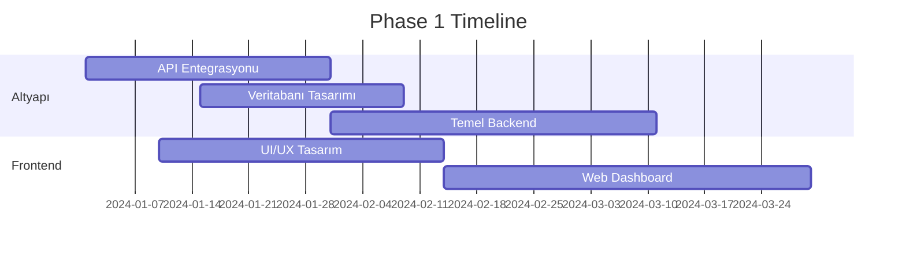

# 🌾 Akıllı Tarım Yönetim Sistemi (ATYS)
## Specification - Blueprint - Roadmap

---

## 📋 İÇİNDEKİLER

1. [Genel Bakış](#genel-bakış)
2. [Sistem Mimarisi](#sistem-mimarisi)
3. [Temel Modüller](#temel-modüller)
4. [Veri Entegrasyonu](#veri-entegrasyonu)
5. [Özellik Detayları](#özellik-detayları)
6. [Teknoloji Stack](#teknoloji-stack)
7. [Geliştirme Roadmap](#geliştirme-roadmap)
8. [Risk Yönetimi](#risk-yönetimi)

---

## 🎯 GENEL BAKIŞ

### Vizyon
Hava durumu verilerini gerçek zamanlı analiz ederek, tarımsal üretimi optimize eden, risk yönetimi sağlayan ve verimliliği maksimize eden entegre bir tarım yönetim platformu.

### Temel Hedefler
- 🌊 **Su Verimliliği**: %40 su tasarrufu
- 🌱 **Verim Artışı**: %25-35 verim artışı
- ⚠️ **Risk Azaltma**: %60 hasar riski azaltma
- 💰 **Maliyet Optimizasyonu**: %30 operasyonel maliyet düşüşü
- 🌍 **Sürdürülebilirlik**: Karbon ayak izi azaltma

---

## 🏗️ SİSTEM MİMARİSİ

```
┌─────────────────────────────────────────────────────────────┐
│                     KULLANICI ARAYÜZÜ                       │
│  ┌─────────┐  ┌─────────┐  ┌─────────┐  ┌─────────┐       │
│  │   Web   │  │ Mobile  │  │   IoT   │  │   API   │       │
│  └─────────┘  └─────────┘  └─────────┘  └─────────┘       │
└─────────────────────────────────────────────────────────────┘
                              │
┌─────────────────────────────────────────────────────────────┐
│                    UYGULAMA KATMANI                         │
│  ┌──────────────────────────────────────────────────┐      │
│  │          Akıllı Karar Destek Sistemi            │      │
│  ├──────────────────────────────────────────────────┤      │
│  │ • Sulama Optimizasyonu    • Hasat Zamanlaması   │      │
│  │ • Hastalık Tahmini        • Risk Analizi        │      │
│  │ • Gübreleme Planı         • Verim Tahmini       │      │
│  └──────────────────────────────────────────────────┘      │
└─────────────────────────────────────────────────────────────┘
                              │
┌─────────────────────────────────────────────────────────────┐
│                      VERİ KATMANI                           │
│  ┌─────────┐  ┌─────────┐  ┌─────────┐  ┌─────────┐       │
│  │Weather  │  │Satellite│  │  IoT    │  │Historical│      │
│  │  API    │  │  Data   │  │ Sensors │  │   Data   │       │
│  └─────────┘  └─────────┘  └─────────┘  └─────────┘       │
└─────────────────────────────────────────────────────────────┘
```

---

## 🔧 TEMEL MODÜLLER

### 1. 💧 AKILLI SULAMA SİSTEMİ

#### Özellikler
```javascript
{
  "sulama_modülü": {
    "gerçek_zamanlı_analiz": {
      "toprak_nemi": ["0-1cm", "1-3cm", "3-9cm", "9-27cm", "27-81cm"],
      "evapotranspirasyon": "ET0 FAO hesaplama",
      "yağış_tahmini": "14 günlük tahmin",
      "optimizasyon": "Makine öğrenmesi ile"
    },
    "otomasyon": {
      "damla_sulama": "Bölge bazlı kontrol",
      "sprinkler": "Rüzgar hızına göre ayarlama",
      "mikro_sulama": "Bitki tipine özel"
    },
    "alarm_sistemi": {
      "düşük_nem": "Kritik seviye uyarısı",
      "aşırı_sulama": "Drenaj kontrolü",
      "don_riski": "Koruyucu sulama"
    }
  }
}
```

#### Kullanılacak API Parametreleri
- `soil_moisture_*`: Toprak nem seviyeleri
- `evapotranspiration`: Buharlaşma-terleme
- `et0_fao_evapotranspiration`: Referans ET
- `precipitation`: Yağış miktarı
- `rain_sum`: Günlük yağış toplamı

### 2. 🌱 BİTKİ SAĞLIĞI İZLEME

#### Hastalık Risk Modelleri
```python
risk_faktörleri = {
    "mantar_hastalıkları": {
        "nem": "relative_humidity_2m > 85%",
        "sıcaklık": "15°C < temperature_2m < 25°C",
        "yaprak_ıslaklığı": "dew_point_2m yakınlığı",
        "risk_skoru": "Yüksek (8/10)"
    },
    "bakteriyel_hastalıklar": {
        "sıcak_nemli": "temperature > 25°C AND humidity > 70%",
        "rüzgar": "wind_speed < 5 km/h",
        "yağış": "rain_sum > 10mm/gün"
    },
    "zararlı_popülasyonu": {
        "derece_gün": "Kümülatif sıcaklık toplamı",
        "nem_stresi": "VPD analizi",
        "tahmin_modeli": "Populasyon dinamiği"
    }
}
```

#### Erken Uyarı Sistemi
- Hastalık tahmin modelleri (7-14 gün)
- Görüntü işleme ile hastalık tespiti
- Drone ile termal görüntüleme
- NDVI analizi için uydu verileri

### 3. 🌪️ RİSK YÖNETİMİ

#### Meteorolojik Riskler
```yaml
risk_matrisi:
  don_riski:
    parametreler:
      - temperature_2m < 0°C
      - freezing_level_height
      - clear_sky_conditions
    önlemler:
      - Don perdesi aktivasyonu
      - Sprinkler ile koruma
      - Isıtıcı sistemler
  
  rüzgar_hasarı:
    tehlike_seviyeleri:
      düşük: "10-25 km/h"
      orta: "25-40 km/h"  
      yüksek: "40-60 km/h"
      kritik: ">60 km/h"
    batı_rüzgarı_özel:
      - wind_direction_10m: "260-280°"
      - özel_koruma: "Rüzgar kıran sistemler"
  
  dolu_riski:
    tahmin: "weather_code: 96, 99"
    koruma: "Dolu ağları otomatik aktivasyon"
  
  sel_taşkın:
    yağış_eşikleri:
      - saatlik: ">20mm"
      - günlük: ">50mm"
      - 3_günlük: ">100mm"
    drenaj_yönetimi: "Otomatik pompa sistemi"
```

### 4. 🌡️ İKLİM ADAPTASYONU

#### Toprak Sıcaklığı Yönetimi
```javascript
const toprakYönetimi = {
  çimlenme_optimizasyonu: {
    izleme_derinlikleri: [0, 6, 18, 54], // cm
    optimal_sıcaklıklar: {
      buğday: "12-25°C",
      mısır: "18-30°C",
      ayçiçeği: "15-28°C",
      sebzeler: "15-25°C"
    },
    ekim_zamanı_önerisi: "ML tabanlı tahmin"
  },
  
  malçlama_stratejisi: {
    siyah_malç: "Sıcaklık artışı için",
    beyaz_malç: "Sıcaklık düşüşü için",
    organik_malç: "Nem koruma"
  }
};
```

### 5. 📊 VERİMLİLİK ANALİTİĞİ

#### Verim Tahmin Modeli
```python
# Çoklu parametre analizi
verim_modeli = {
    "ışık_entegrasyonu": {
        "solar_radiation": "shortwave_radiation_sum",
        "sunshine_duration": "Fotosentez hesaplama",
        "gölgeleme_analizi": "cloud_cover_*"
    },
    "su_stresi_indeksi": {
        "VPD": "vapour_pressure_deficit",
        "toprak_su_dengesi": "soil_moisture profili",
        "stres_katsayısı": "0.1 - 1.0"
    },
    "büyüme_derece_günleri": {
        "GDD": "Kümülatif sıcaklık",
        "fenolojik_dönem": "Gelişim aşaması",
        "hasat_tahmini": "±3 gün hassasiyet"
    }
}
```

---

## 🔌 VERİ ENTEGRASYONU

### API Entegrasyon Stratejisi

```javascript
class WeatherDataManager {
  constructor() {
    this.baseURL = 'https://api.open-meteo.com/v1/forecast';
    this.coordinates = {
      latitude: 38.574,
      longitude: 31.857
    };
  }

  async getComprehensiveData() {
    const params = {
      // Temel parametreler
      latitude: this.coordinates.latitude,
      longitude: this.coordinates.longitude,
      
      // Saatlik veriler (kritik tarım parametreleri)
      hourly: [
        'temperature_2m', 'relative_humidity_2m', 'dew_point_2m',
        'precipitation', 'rain', 'showers', 'snowfall',
        'soil_temperature_0cm', 'soil_temperature_6cm',
        'soil_temperature_18cm', 'soil_temperature_54cm',
        'soil_moisture_0_to_1cm', 'soil_moisture_1_to_3cm',
        'soil_moisture_3_to_9cm', 'soil_moisture_9_to_27cm',
        'wind_speed_10m', 'wind_direction_10m', 'wind_gusts_10m',
        'et0_fao_evapotranspiration', 'vapour_pressure_deficit',
        'shortwave_radiation', 'weather_code'
      ].join(','),
      
      // Günlük özet veriler
      daily: [
        'temperature_2m_max', 'temperature_2m_min',
        'precipitation_sum', 'rain_sum', 'precipitation_hours',
        'wind_speed_10m_max', 'wind_gusts_10m_max',
        'wind_direction_10m_dominant', 'sunshine_duration',
        'et0_fao_evapotranspiration', 'uv_index_max'
      ].join(','),
      
      // Zaman aralığı
      past_days: 7,
      forecast_days: 14
    };
    
    return await this.fetchWeatherData(params);
  }

  processForAgriculture(data) {
    return {
      irrigation: this.calculateIrrigationNeeds(data),
      disease_risk: this.assessDiseaseRisk(data),
      frost_warning: this.checkFrostRisk(data),
      harvest_timing: this.optimizeHarvestTime(data),
      fertilization: this.planFertilization(data)
    };
  }
}
```

### IoT Sensör Ağı

```yaml
sensör_tipleri:
  toprak_sensörleri:
    - Nem sensörleri (çoklu derinlik)
    - EC/pH sensörleri
    - Sıcaklık sensörleri
    - NPK sensörleri
  
  atmosfer_sensörleri:
    - Mini meteoroloji istasyonu
    - Yaprak ıslaklığı sensörü
    - CO2 sensörü
    - PAR ışık sensörü
  
  bitki_sensörleri:
    - Dendrometreler (gövde çapı)
    - Sap akış sensörleri
    - Yaprak sıcaklığı sensörleri
    - Klorofil sensörleri

veri_toplama:
  frekans: "5-15 dakika"
  protokol: "LoRaWAN / NB-IoT"
  edge_computing: "Yerel veri işleme"
  cloud_sync: "Gerçek zamanlı senkronizasyon"
```

---

## 🚀 TEKNOLOJİ STACK

### Backend Altyapı
```javascript
const techStack = {
  backend: {
    runtime: "Node.js v20 LTS",
    framework: "NestJS",
    database: {
      primary: "PostgreSQL + TimescaleDB",
      cache: "Redis",
      nosql: "MongoDB (görüntüler)"
    },
    queue: "Bull (Redis tabanlı)",
    realtime: "Socket.io"
  },
  
  frontend: {
    web: "React 18 + TypeScript",
    mobile: "React Native",
    dashboard: "Next.js 14",
    charts: "Apache ECharts",
    maps: "Mapbox GL"
  },
  
  ml_pipeline: {
    framework: "TensorFlow / PyTorch",
    serving: "TensorFlow Serving",
    training: "Kubeflow",
    feature_store: "Feast"
  },
  
  infrastructure: {
    cloud: "AWS / Azure",
    containers: "Docker + Kubernetes",
    ci_cd: "GitLab CI / GitHub Actions",
    monitoring: "Prometheus + Grafana",
    logging: "ELK Stack"
  }
};
```

### Makine Öğrenmesi Modelleri

```python
ml_models = {
    "verim_tahmini": {
        "algoritma": "Random Forest + LSTM",
        "features": ["hava", "toprak", "bitki", "yönetim"],
        "accuracy": "R² > 0.85"
    },
    "hastalık_tespiti": {
        "model": "CNN (ResNet50)",
        "dataset": "PlantVillage + Özel",
        "accuracy": "> 95%"
    },
    "sulama_optimizasyonu": {
        "model": "Reinforcement Learning",
        "algoritma": "Deep Q-Network",
        "reward": "Su tasarrufu + Verim"
    },
    "fiyat_tahmini": {
        "model": "ARIMA + XGBoost",
        "veri": "Pazar + Hava + Sosyal",
        "horizon": "30-90 gün"
    }
}
```

---

## 📅 GELİŞTİRME ROADMAP

### Phase 1: Temel Altyapı (0-3 Ay)


**Deliverables:**
- ✅ Weather API tam entegrasyon
- ✅ PostgreSQL + TimescaleDB kurulum
- ✅ Temel dashboard (React)
- ✅ Kullanıcı yönetimi
- ✅ Temel raporlama

### Phase 2: Akıllı Sulama (3-6 Ay)
```yaml
hedefler:
  - Sulama algoritması geliştirme
  - IoT sensör entegrasyonu
  - Mobil uygulama (iOS/Android)
  - Otomatik sulama kontrolü
  - Su tüketimi raporları

kpi:
  su_tasarrufu: "%30"
  otomasyon_oranı: "%80"
  kullanıcı_memnuniyeti: ">4.5/5"
```

### Phase 3: Hastalık & Risk Yönetimi (6-9 Ay)
```python
features = [
    "Hastalık tahmin modeli",
    "Görüntü işleme ile tespit",
    "Risk haritaları",
    "Erken uyarı sistemi",
    "İlaçlama takvimi",
    "Drone entegrasyonu"
]

success_metrics = {
    "hastalık_tespiti": "7 gün önce",
    "doğruluk": ">90%",
    "kayıp_azaltma": "%50"
}
```

### Phase 4: İleri Analitik (9-12 Ay)
```javascript
const advancedFeatures = {
  ai_modules: [
    "Verim tahmin modeli",
    "Pazar fiyat analizi",
    "Optimum hasat zamanı",
    "Karbon ayak izi hesaplama",
    "Sürdürülebilirlik raporu"
  ],
  
  integrations: [
    "ERP sistemleri",
    "Muhasebe yazılımları",
    "Lojistik platformları",
    "E-ticaret entegrasyonu"
  ],
  
  premium_features: [
    "Uydu görüntü analizi",
    "Hiperspektral görüntüleme",
    "Blockchain izlenebilirlik",
    "AI destekli danışmanlık"
  ]
};
```

### Phase 5: Ölçekleme & Optimizasyon (12+ Ay)
- 🌍 Çoklu dil desteği
- 🔄 API marketplace
- 📱 Gelişmiş mobil özellikler
- 🤖 Otonom tarım robotları entegrasyonu
- 🎯 Sektörel özelleştirmeler
- 📊 Büyük veri analitiği

---

## ⚠️ RİSK YÖNETİMİ

### Teknik Riskler
```yaml
risk_matrisi:
  veri_kalitesi:
    olasılık: "Orta"
    etki: "Yüksek"
    önlem: "Çoklu veri kaynağı, veri doğrulama"
  
  api_kesintileri:
    olasılık: "Düşük"
    etki: "Yüksek"
    önlem: "Önbellekleme, yedek API'ler"
  
  model_doğruluğu:
    olasılık: "Orta"
    etki: "Orta"
    önlem: "Sürekli model güncelleme, A/B test"
  
  ölçeklenebilirlik:
    olasılık: "Düşük"
    etki: "Orta"
    önlem: "Mikroservis mimarisi, auto-scaling"
```

### İş Riskleri
- **Kullanıcı Adaptasyonu**: Eğitim programları, kullanıcı dostu arayüz
- **Regülasyon Uyumu**: KVKK, GDPR, tarım mevzuatı takibi
- **Rekabet**: Sürekli inovasyon, müşteri odaklılık
- **Finansal Sürdürülebilirlik**: SaaS model, kademeli fiyatlandırma

---

## 📈 BAŞARI METRİKLERİ

### Performans KPI'ları
```javascript
const kpiDashboard = {
  operasyonel: {
    su_verimliliği: "Litre/kg ürün",
    enerji_tüketimi: "kWh/hektar",
    işgücü_verimliliği: "Saat/ton",
    makine_kullanım_oranı: "%"
  },
  
  agronomik: {
    verim_artışı: "%",
    kalite_skoru: "A-B-C sınıfı",
    hastalık_insidansı: "Olay/hektar",
    toprak_sağlığı_indeksi: "0-100"
  },
  
  finansal: {
    roi: "Yatırım getirisi",
    maliyet_tasarrufu: "₺/hektar",
    gelir_artışı: "%",
    kar_marjı: "%"
  },
  
  sürdürülebilirlik: {
    karbon_ayak_izi: "CO2 ton/hektar",
    su_ayak_izi: "m³/ton",
    biyoçeşitlilik_skoru: "0-10",
    toprak_organik_madde: "%"
  }
};
```

---

## 🎯 SONUÇ VE VİZYON

Bu blueprint, modern tarımın karşılaştığı zorlukları teknoloji ile çözen, veri odaklı, sürdürülebilir ve ölçeklenebilir bir platform sunmaktadır.

### Uzun Vadeli Hedefler
1. **2025**: 1000+ aktif kullanıcı
2. **2026**: Uluslararası ekspansiyon
3. **2027**: Otonom tarım sistemleri
4. **2028**: Karbon negatif tarım
5. **2030**: Global tarım ağı lideri

### İletişim ve Destek
```yaml
proje_ekibi:
  teknik_lider: "CTO"
  ürün_müdürü: "Product Owner"
  tarım_uzmanı: "Agronomi Danışmanı"
  veri_bilimci: "ML Engineer"
  
destek_kanalları:
  email: "destek@smartfarm.com"
  telefon: "7/24 Çağrı Merkezi"
  whatsapp: "Anlık Destek"
  eğitim: "Online/Yerinde Eğitim"
```

---

*"Teknoloji ile büyüyen tarım, sürdürülebilir gelecek"* 🌱

**Versiyon**: 1.0  
**Güncelleme**: Ocak 2024  
**Lisans**: Proprietary  
**Dokümantasyon**: [docs.smartfarm.com]

---

Ben IOT Sistemlerini kullanmayacağım, çünkü sistemimde yok, postgresql de kullanmayacağız mongodb yüklü, dağıtmımız da vercel üzerinde. Bu yapı çok iyi, bunu uygulayalım.

---

Bu dosya okuması bitince docs\weather\yeni_kodlama.md dosyasını değerlendir, fikirleşelim.