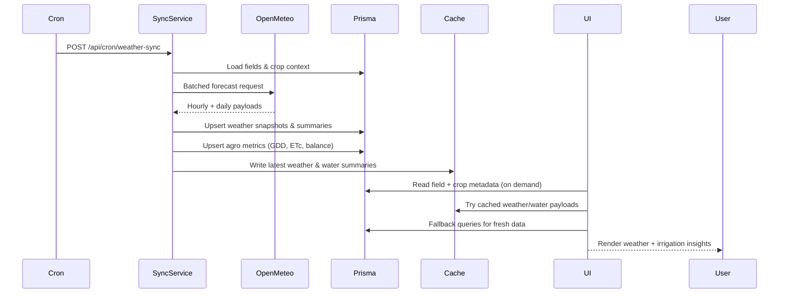
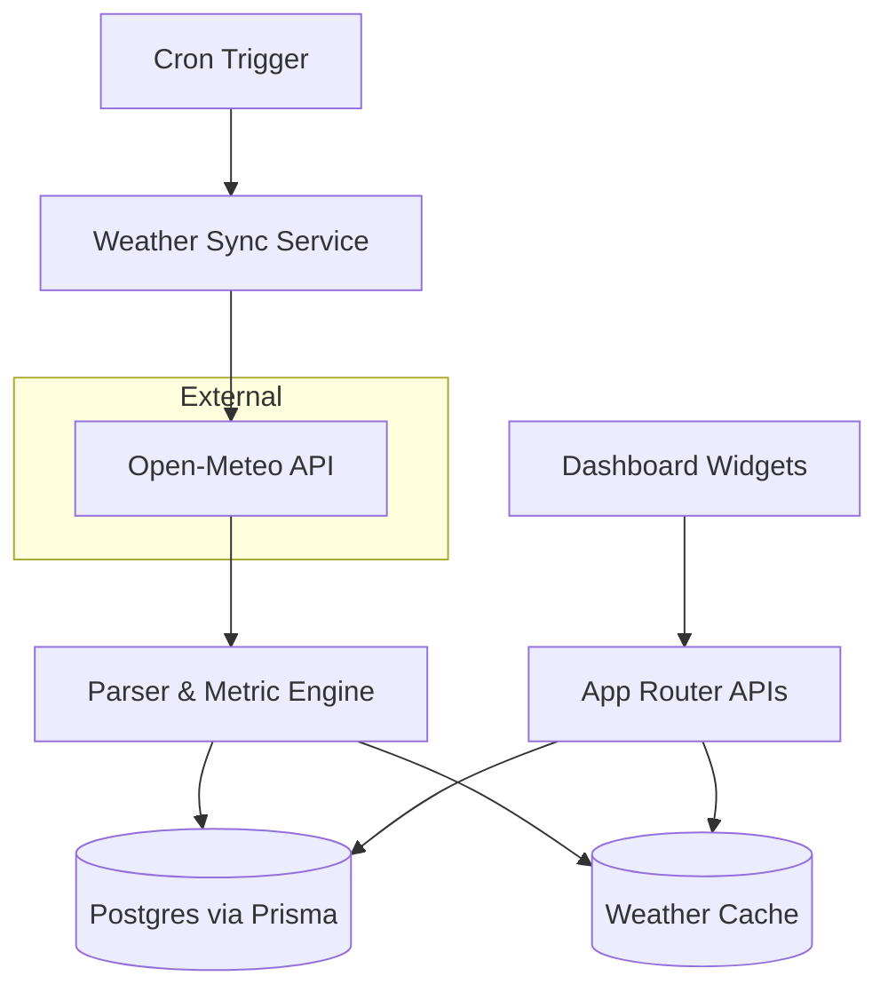

# Weather Integration Flow

## Timeline
- T0 (every 3 hours): Cron job `api/cron/weather-sync` is triggered by scheduler.
- T0 + 1s: Cron handler loads field coordinates and active crops, chunks requests, and calls Open-Meteo.
- T0 + 5s: Open-Meteo responses are parsed; hourly snapshots and daily summaries are upserted; agronomic metrics are recomputed.
- T0 + 6s: Weather cache is refreshed; notifications are queued if thresholds are crossed.
- User request time: Dashboard widgets call `/api/weather/fields/[fieldId]` (and `/api/water-consumption/...`) to render the latest state.

## Sequence Diagram

## Data Flow Diagram

## Notes
- Weather snapshots keep hourly observations for the last 24-48 hours; daily summaries and agro metrics persist long term.
- Water consumption heuristics fall back to generic crop coefficients when field crop status is missing.
- Widget clients prefer cached responses but gracefully fall back to live Prisma queries when cache misses occur.
