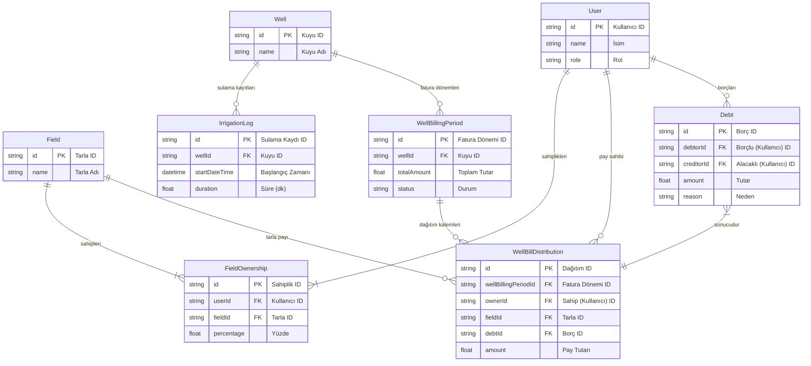

# Kuyu Faturalandırma ve Borçlandırma ER Diyagramı

`prisma.schema` dosyasını kullanarak kuyu faturalandırma ve borçlandırma süreciyle ilgili temel modelleri içeren bir Varlık-İlişki (ER) Diyagramı kodu aşağıda sunulmuştur.

Tüm veritabanı şemasını çizmek diyagramı çok karmaşık hale getireceği için, analizimizin odak noktası olan modellere yoğunlaşılmıştır. Bu, süreci daha net anlamanıza yardımcı olacaktır.

Aşağıdaki [Mermaid](https://mermaid.js.org/) kodunu kopyalayıp [Mermaid Live Editor](https://mermaid.live) gibi online bir araca yapıştırarak görsel diyagramı oluşturabilirsiniz.

## Mermaid Kodu

## Diyagramdaki İlişkilerin Açıklaması

*   `User` ve `Field` arasında `FieldOwnership` aracılığıyla **çoktan-çoğa** bir ilişki vardır (Bir kullanıcının birden çok tarlası olabilir, bir tarlanın birden çok sahibi olabilir).
*   Bir `Well` (Kuyu), birden çok `IrrigationLog` (Sulama Kaydı) ve `WellBillingPeriod` (Fatura Dönemi) içerebilir.
*   Bir `WellBillingPeriod`, birden çok `WellBillDistribution` (Dağıtım Kalemi) içerir.
*   Her bir `WellBillDistribution` kaydı, **sadece bir** `Debt` (Borç) kaydı oluşturur. Bu, aralarındaki `}|--||` sembolü ile gösterilen **bire-bir** ilişkidir ve sürecin en önemli bağlantısıdır.
*   Bir `User` (Kullanıcı), hem `WellBillDistribution`'da pay sahibi hem de `Debt` tablosunda borçlu veya alacaklı olarak yer alır.
