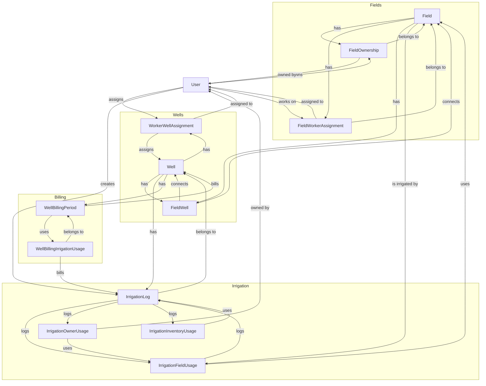

# Project Analysis: Field Ownership, Wells, Irrigation, and Billing

## Table of Contents
1. [Introduction](#introduction)
2. [Field Ownership](#field-ownership)
3. [Wells](#wells)
4. [Irrigation](#irrigation)
5. [Billing](#billing)
6. [Flow Chart](#flow-chart)
7. [Conclusion](#conclusion)

## Introduction

This report provides an analysis of the project's structure and functionality related to field ownership, wells, irrigation, and billing. The project uses a complex data model to manage these aspects, with relationships between fields, users, wells, irrigation logs, and billing periods.

## Field Ownership

Field ownership is managed through the `FieldOwnership` model, which represents the ownership of fields by users. Each field can have multiple owners, with each owner having a percentage of ownership. The `FieldWorkerAssignment` model represents the assignment of workers to fields.

### Key Models

- **Field**: Represents a field in the system, with attributes such as name, location, size, and status.
- **FieldOwnership**: Represents the ownership of a field by a user, with a percentage of ownership.
- **FieldWorkerAssignment**: Represents the assignment of a worker to a field.

### Components

- **FieldOwnershipForm**: Allows users to manage field ownership by assigning percentages to different owners.
- **FieldForm**: Allows users to create and manage fields.
- **FieldList**: Displays a list of fields.

## Wells

Wells are managed through the `Well` model, which represents a well in the system. Wells can be associated with fields through the `FieldWell` join model, and can have billing periods through the `WellBillingPeriod` model.

### Key Models

- **Well**: Represents a well in the system, with attributes such as name, depth, capacity, and status.
- **FieldWell**: Represents the association between a field and a well.
- **WorkerWellAssignment**: Represents the assignment of a worker to a well.

### Components

- **WellForm**: Allows users to create and manage wells.
- **WellList**: Displays a list of wells.

## Irrigation

Irrigation is managed through the `IrrigationLog` model, which represents an irrigation event. Irrigation logs can be associated with wells and fields, and can track the usage of inventory.

### Key Models

- **IrrigationLog**: Represents an irrigation event, with attributes such as start date, duration, and notes.
- **IrrigationFieldUsage**: Represents the usage of a field during an irrigation event.
- **IrrigationOwnerUsage**: Represents the usage of a field by an owner during an irrigation event.
- **IrrigationInventoryUsage**: Represents the usage of inventory during an irrigation event.

### Components

- **IrrigationForm**: Allows users to create and manage irrigation logs.
- **IrrigationList**: Displays a list of irrigation logs.

## Billing

Billing is managed through the `WellBillingPeriod` model, which represents a billing period for a well. Billing periods can track the usage of irrigation logs and calculate the total amount due.

### Key Models

- **WellBillingPeriod**: Represents a billing period for a well, with attributes such as start date, end date, and total amount.
- **WellBillingIrrigationUsage**: Represents the usage of an irrigation log during a billing period.

### Components

- **WellBillForm**: Allows users to create and manage well billing records.
- **BillingPeriodForm**: Allows users to create and manage billing periods.

## Flow Chart

The flow chart below illustrates the relationships between fields, ownership, wells, irrigation, and billing in the project.

## Conclusion

This report provides an overview of the project's structure and functionality related to field ownership, wells, irrigation, and billing. The project uses a complex data model to manage these aspects, with relationships between fields, users, wells, irrigation logs, and billing periods. The flow chart illustrates these relationships, providing a visual representation of the system's architecture.
