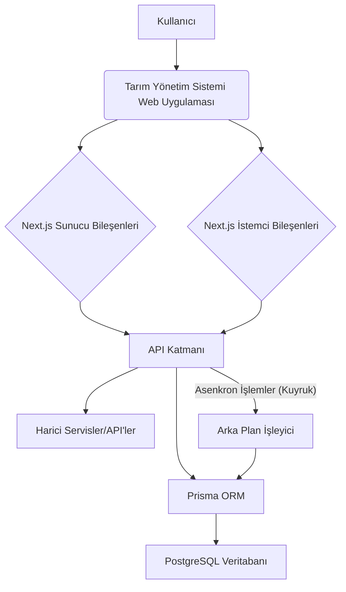

# Sistem Kalıpları

Bu belge, Tarım Yönetim Sistemi projesinin sistem mimarisini, temel teknik kararlarını, kullanılan tasarım kalıplarını ve bileşen ilişkilerini açıklar.

## 1. Sistem Mimarisi
Proje, Next.js'in App Router yapısını kullanarak bir monolitik uygulama olarak tasarlanmıştır. Bu yapı, hem sunucu tarafı renderlama (SSR) hem de istemci tarafı etkileşimleri için esneklik sağlar. Karmaşık işlemler için API'ler parçalara ayrılmış ve asenkron işleme potansiyeli entegre edilmiştir.

## 2. Temel Teknik Kararlar
*   **Next.js App Router**: Modern web uygulamaları için güçlü bir yapı sunması, sunucu ve istemci bileşenlerini bir arada kullanabilme yeteneği.
*   **TypeScript**: Geliştirme sürecinde tip güvenliği sağlayarak hataları azaltma ve kod kalitesini artırma.
*   **Prisma ORM**: Veritabanı etkileşimlerini basitleştirme, şema yönetimi ve migrasyon kolaylığı.
*   **Tailwind CSS**: Hızlı ve esnek UI geliştirme, stil tutarlılığı.
*   **NextAuth.js**: Güvenli ve kolay kimlik doğrulama çözümü.
*   **Parçalı API Tasarımı**: Uzun süren veya karmaşık işlemleri (örn. `Process` kaydetme) daha küçük, yönetilebilir API endpoint'lerine bölme.
*   **Asenkron İşleme Yaklaşımı**: Performans darboğazlarını gidermek ve kullanıcı deneyimini iyileştirmek için zaman alıcı işlemleri (örn. maliyet hesaplama, bildirim gönderme) arka plana taşıma potansiyeli.

## 3. Tasarım Kalıpları
*   **Modüler Tasarım**: Her bir ana özellik (Envanter, Sulama, Süreç vb.) kendi içinde bağımsız modüller olarak geliştirilir.
*   **Bileşen Tabanlı Mimari**: React bileşenleri kullanılarak UI'ın küçük, yeniden kullanılabilir parçalara ayrılması.
*   **Katmanlı Mimari**: Uygulama, sunum (UI), iş mantığı (API rotaları, servisler) ve veri erişim (Prisma) katmanlarına ayrılmıştır.
*   **Repository/Service Pattern**: Veritabanı etkileşimleri için `lib/prisma.ts` üzerinden merkezi bir Prisma istemcisi kullanılması ve iş mantığının servis katmanlarında ayrıştırılması.
*   **Wizard Form Pattern**: Karmaşık ve çok adımlı veri giriş süreçleri için kullanıcı deneyimini iyileştiren ve backend yükünü dağıtan bir yaklaşım.

## 4. Bileşen İlişkileri
*   **`app/`**: Ana uygulama rotalarını ve sayfalarını barındırır. `app/dashboard` gibi alt dizinler, belirli kullanıcı rolleri veya ana bölümler için düzenlenmiştir.
*   **`components/`**: Yeniden kullanılabilir UI bileşenlerini içerir. `components/ui` genel bileşenler için, `components/[feature]` ise özelliğe özel bileşenler içindir.
*   **`lib/`**: Yardımcı fonksiyonlar, servisler, veritabanı bağlantısı (`lib/prisma.ts`) ve kimlik doğrulama yardımcıları (`lib/auth.ts`) gibi genel mantık katmanını barındırır.
*   **`prisma/`**: Veritabanı şeması (`schema.prisma`) ve migrasyon dosyalarını içerir.
*   **`types/`**: TypeScript tip tanımlamalarını merkezi olarak barındırır.

## 5. Kritik Uygulama Yolları
*   **Kimlik Doğrulama Akışı**: Kullanıcı girişi -> NextAuth.js ile kimlik doğrulama -> JWT oluşturma -> Oturum yönetimi.
*   **Veri Akışı (Örnek: İşlem Ekleme - Çok Adımlı)**:
    1.  **Adım 1 (Temel Bilgiler)**: İstemci bileşeni (form) -> `POST /api/processes` (initiate) -> `Process` taslağı oluşturulur, `processId` döner.
    2.  **Adım 2 (Envanter/Ekipman)**: İstemci bileşeni (form) -> `PUT /api/processes?processId={id}` (inventory/equipment update) -> Envanter düşüşleri ve ekipman kullanımları yapılır, `Process` durumu güncellenir.
    3.  **Adım 3 (Sonlandırma)**: İstemci bileşeni (form) -> `POST /api/processes/finalize?processId={id}` (finalize) -> Maliyet hesaplamaları, bildirim gönderme gibi işlemler tetiklenir (potansiyel olarak asenkron), `Process` durumu `FINALIZED` olarak güncellenir.
*   **Raporlama Akışı**: Kullanıcı isteği (rapor türü) -> API rotası (GET /api/reports) -> Veritabanından veri çekme -> Veri işleme -> İstemciye rapor verisi gönderme.
